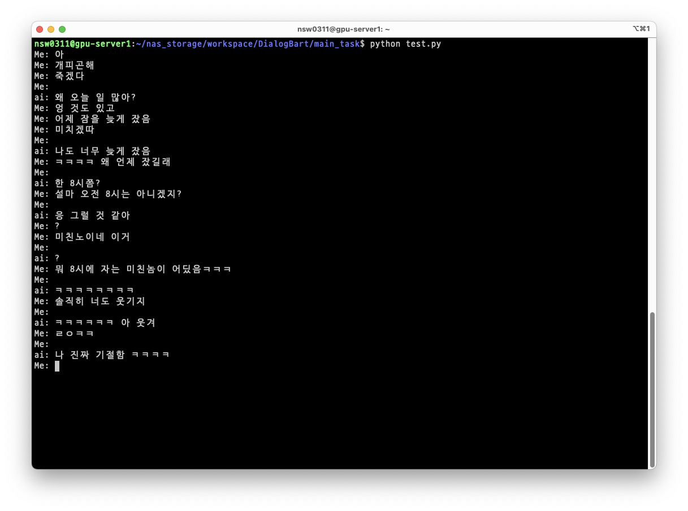

# DialogBart
카카오톡 대화 내용으로 학습한 bart 모델입니다.  
구어체나 일반적인 대화체가 아닌 1:1 메신저 데이터셋으로 학습했기에 1:1 open-domain 대화에 강합니다.  
오픈소스 데이터셋과 개인적으로 수집한 데이터셋을 사용했으며, 총 1.4 GB의 데이터를 사용해 사전학습을 진행했습니다.  

DialogBart를 학습하는데 사용한 데이터의 대부분은 오픈 데이터를 사용하나, 개인적인 데이터가 포함된 비공개 데이터가 일부 포함되어 있습니다.  
따라서 모델과 tokenzier를 공개하는데에는 무리가 있음을 알립니다.

# About
|                | **Vocab Size** | **Layers** | **Hidden Size** | **Num Heads** |
|----------------|----------------|------------|-----------------|---------------|
| **DialogBart** | 20,000         | 12         | 512             | 4             |

장비의 한계로 인해 논문에 기재되지 않은 더 작은 사이즈로 학습했습니다.  
추후 더 많은 데이터와 장비가 확보될 시 논문에 기재된 base 모델로 학습시킬 예정이며, 학습된 가중치를 가지고 Longformer 모델 학습을 기획중입니다.

## Pretraining Details
|                | **Batch Size** | **Train Steps** | **LR** | **Max Seq Len** |
|----------------|----------------|-----------------|--------|-----------------|
| **DialogBart** | 28 * 4         | 1,000,000       | 5e-4   | 512             |

# Example
  
오타에도 제대로 반응하는 것을 볼 수 있고, 어느정도의 정상적인 대화가 가능합니다.